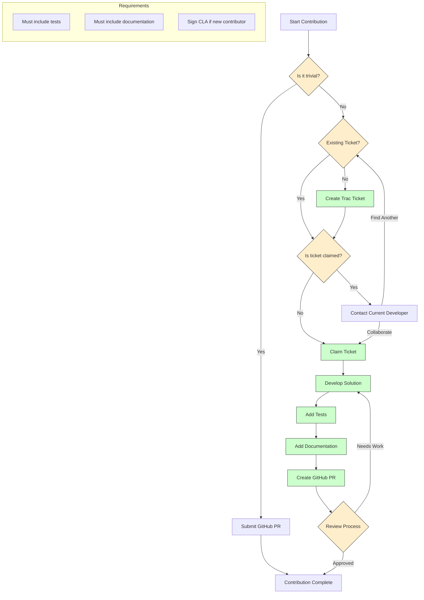

Below is a rough draft of the current submitting patches workflow based on [Submitting Contributions](https://docs.djangoproject.com/en/dev/internals/contributing/writing-code/submitting-patches/)

