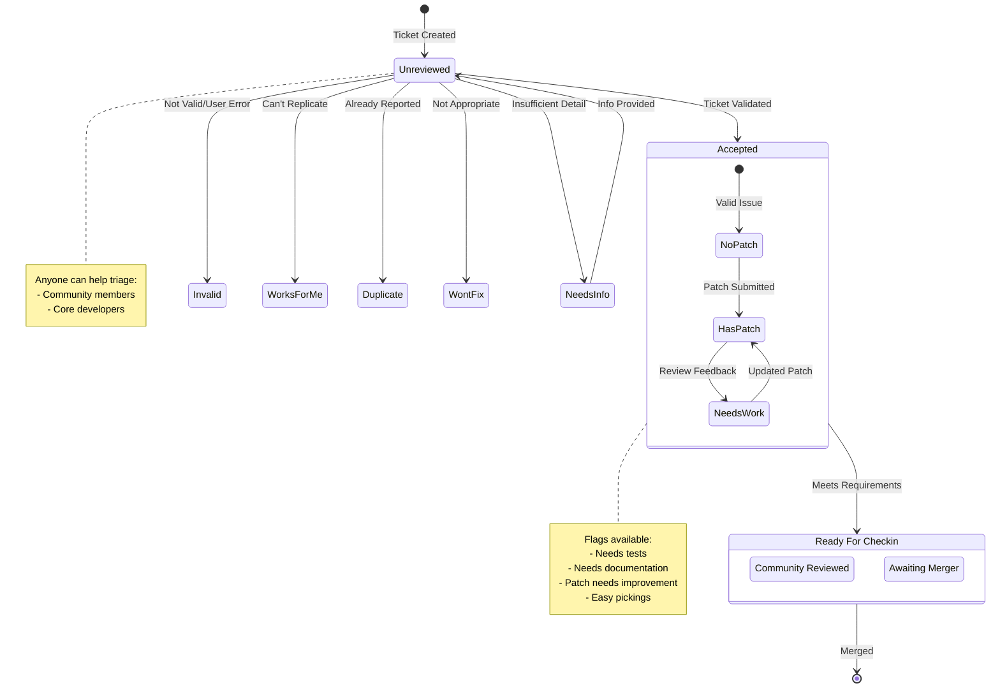

Below is a rough draft of the current ticket triage workflow based on [Triaging Tickets](https://docs.djangoproject.com/en/dev/internals/contributing/triaging-tickets/)

```mermaid
stateDiagram-v2
    [*] --> Unreviewed: Ticket Created
    
    state "Accepted" as accepted {
        [*] --> NoPatch: Valid Issue
        NoPatch --> HasPatch: Patch Submitted
        HasPatch --> NeedsWork: Review Feedback
        NeedsWork --> HasPatch: Updated Patch
    }
    
    state "Ready For Checkin" as rfc {
        state "Community Reviewed" as cr
        state "Awaiting Merger" as am
    }
    
    Unreviewed --> accepted: Ticket Validated
    Unreviewed --> Invalid: Not Valid/User Error
    Unreviewed --> WorksForMe: Can't Replicate
    Unreviewed --> Duplicate: Already Reported
    Unreviewed --> WontFix: Not Appropriate
    Unreviewed --> NeedsInfo: Insufficient Detail
    
    accepted --> rfc: Meets Requirements
    rfc --> [*]: Merged
    
    NeedsInfo --> Unreviewed: Info Provided
    
    note right of accepted
        Flags available:
        - Needs tests
        - Needs documentation
        - Patch needs improvement
        - Easy pickings
    end note
    
    note right of Unreviewed
        Anyone can help triage:
        - Community members
        - Core developers
    end note
```